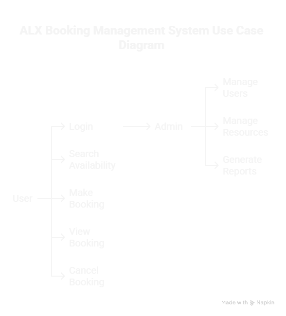

## <h1> Requirement Analysis in Software Development </h1>
 

## <strong>Introduction</strong>

This repository serves as a <strong>comprehensive guide</strong> and documentation hub for understanding and implementing requirement analysis in software development projects. Requirement analysis is a <em>critical phase</em> in the <strong>Software Development Life Cycle (SDLC)</strong> that forms the foundation for successful project delivery.

The primary purpose of this repository is to demonstrate best practices in requirement analysis through practical examples, focusing on a <strong>Booking Management System</strong> case study to provide real-world context and applications.

 

---

 

## <strong>What is Requirement Analysis?</strong>

<strong>Requirement Analysis</strong> is a systematic process of identifying, documenting, and managing the needs and expectations of stakeholders for a software system. It involves thoroughly understanding what the system should do, how it should perform, and what constraints it must operate under.

<blockquote>

<em>"Requirement Analysis is the foundation upon which successful software systems are built. It bridges the gap between stakeholder needs and technical implementation."</em>

</blockquote>

In the context of the Software Development Life Cycle (SDLC), Requirement Analysis serves as the <strong>critical first phase</strong> that:

<ul>
  <li><strong>Establishes the project scope</strong> and boundaries</li>
  <li><strong>Defines system functionality</strong> and performance expectations</li>
  <li><strong>Identifies stakeholders</strong> and their specific needs</li>
  <li><strong>Creates a roadmap</strong> for design and development phases</li>
  <li><strong>Minimizes risks</strong> by addressing ambiguities early in the process</li>
</ul>

  
<strong>💡 Key Insight:</strong> Effective requirement analysis can reduce project costs by up to 10-15% and significantly decrease the likelihood of project failure.

 

---

 

## <strong>Why is Requirement Analysis Important?</strong>

Requirement Analysis is <em>fundamental to successful software development</em> for several critical reasons:

 

### <strong>1. 🎯 Prevents Scope Creep and Miscommunication</strong>

Clear, well-documented requirements serve as a <strong>single source of truth</strong> for all stakeholders. This prevents misunderstandings between clients, developers, and project managers, ensuring everyone has the same vision of the final product.

<ul>
  <li>Reduces back-and-forth communication</li>
  <li>Eliminates assumptions and ambiguities</li>
  <li>Provides a reference point for decision-making</li>
</ul>

 

### <strong>2. 💰 Reduces Development Costs and Time</strong>

Investing time in thorough requirement analysis <strong>significantly reduces costs</strong> in later phases of development. Studies show that fixing a defect during the requirements phase costs 10-100 times less than fixing it during testing or after deployment.

<ul>
  <li>Early identification of potential issues</li>
  <li>Reduced rework and code refactoring</li>
  <li>More accurate project estimates and timelines</li>
</ul>

 

### <strong>3. ✅ Ensures Quality and User Satisfaction</strong>

Well-analyzed requirements lead to software that <strong>truly meets user needs</strong> and business objectives. This results in higher user adoption rates and customer satisfaction.

<ul>
  <li>Aligns development with business goals</li>
  <li>Improves user experience and functionality</li>
  <li>Increases the likelihood of project success</li>
</ul>

 

---

 

## <strong>Key Activities in Requirement Analysis</strong>

The Requirement Analysis process consists of <strong>five essential activities</strong> that work together to create a comprehensive understanding of system needs:

 

### <strong>• Requirement Gathering</strong>

The initial phase of <em>collecting information</em> from various stakeholders, including clients, end-users, business analysts, and subject matter experts. This involves conducting interviews, surveys, workshops, and document analysis to understand the business context and user needs.

 

### <strong>• Requirement Elicitation</strong>

A more <em>focused and interactive process</em> of extracting detailed requirements through techniques like brainstorming sessions, use case development, prototyping, and observation of existing systems. This goes beyond simple gathering to actively draw out implicit and hidden requirements.

 

### <strong>• Requirement Documentation</strong>

The systematic process of <em>recording and organizing</em> all identified requirements in a clear, structured format. This includes creating requirement specifications, user stories, acceptance criteria, and maintaining traceability matrices to ensure nothing is overlooked.

 

### <strong>• Requirement Analysis and Modeling</strong>

The <em>analytical phase</em> where requirements are examined, prioritized, and modeled using various techniques such as use case diagrams, data flow diagrams, and entity-relationship diagrams. This helps identify conflicts, dependencies, and gaps in the requirements.

 

### <strong>• Requirement Validation</strong>

The final phase that <em>ensures requirements are complete, consistent, and feasible</em>. This involves reviewing requirements with stakeholders, conducting feasibility studies, and creating test cases to verify that the requirements can be implemented and tested effectively.

 

---

 

## <strong>Types of Requirements</strong>

Requirements are broadly categorized into two main types, each serving different aspects of system functionality and performance:

 

### <strong>📋 Functional Requirements</strong>

<strong>Functional Requirements</strong> define <em>what the system should do</em> - the specific behaviors, functions, and features that the system must provide to meet user needs and business objectives.

<strong>Examples for Booking Management System:</strong>

<table>
  <tr>
    <td><strong>Requirement</strong></td>
    <td><strong>Description</strong></td>
  </tr>
  <tr>
    <td>User Registration</td>
    <td>The system shall allow new users to create accounts with email verification</td>
  </tr>
  <tr>
    <td>Search & Filter</td>
    <td>Users shall be able to search for available bookings by date, location, and type</td>
  </tr>
  <tr>
    <td>Booking Creation</td>
    <td>The system shall enable users to make, modify, and cancel bookings</td>
  </tr>
  <tr>
    <td>Payment Processing</td>
    <td>The system shall integrate with payment gateways to process transactions securely</td>
  </tr>
  <tr>
    <td>Notification System</td>
    <td>Users shall receive email/SMS confirmations and reminders for their bookings</td>
  </tr>
</table>

 

### <strong>⚡ Non-functional Requirements</strong>

<strong>Non-functional Requirements</strong> define <em>how the system should perform</em> - the quality attributes, constraints, and standards that the system must meet to ensure optimal performance and user experience.

<strong>Examples for Booking Management System:</strong>

<table>
  <tr>
    <td><strong>Category</strong></td>
    <td><strong>Requirement</strong></td>
    <td><strong>Specification</strong></td>
  </tr>
  <tr>
    <td>Performance</td>
    <td>Response Time</td>
    <td>System shall respond to user requests within 2 seconds</td>
  </tr>
  <tr>
    <td>Scalability</td>
    <td>Concurrent Users</td>
    <td>System shall support up to 1000 concurrent users</td>
  </tr>
  <tr>
    <td>Security</td>
    <td>Data Protection</td>
    <td>All sensitive data shall be encrypted using AES-256 standard</td>
  </tr>
  <tr>
    <td>Availability</td>
    <td>Uptime</td>
    <td>System shall maintain 99.9% uptime with minimal downtime</td>
  </tr>
  <tr>
    <td>Usability</td>
    <td>Interface</td>
    <td>System shall be accessible on mobile and desktop platforms</td>
  </tr>
</table>

 

---

 

## <strong>Use Case Diagrams</strong>

<strong>Use Case Diagrams</strong> are visual representations that show the <em>interactions between users (actors) and the system</em> to achieve specific goals. They provide a high-level overview of system functionality from the user's perspective.

 

### <strong>Benefits of Use Case Diagrams:</strong>

<ul>
  <li><strong>Clear Communication:</strong> Provide a visual language that both technical and non-technical stakeholders can understand</li>
  <li><strong>Scope Definition:</strong> Help define system boundaries and identify what's included in the project</li>
  <li><strong>User-Centered Design:</strong> Focus on user goals and interactions rather than technical implementation</li>
  <li><strong>Requirements Validation:</strong> Make it easier to verify that all user needs are addressed</li>
  <li><strong>Testing Foundation:</strong> Serve as a basis for creating test cases and scenarios</li>
</ul>

 

### <strong>Booking System Use Case Diagram</strong>

  
   
  <em>Use Case Diagram for ALX Booking Management System</em>

 

<strong>📝 Actors and Use Cases Description</strong>

 

<strong>Actors:</strong>

<ul>
  <li><strong>Customer:</strong> End user who makes bookings</li>
  <li><strong>Admin:</strong> System administrator who manages the platform</li>
  <li><strong>Payment Gateway:</strong> External system for processing payments</li>
</ul>

<strong>Main Use Cases:</strong>

<ul>
  <li>Register/Login</li>
  <li>Search Bookings</li>
  <li>Make Booking</li>
  <li>Manage Bookings</li>
  <li>Process Payment</li>
  <li>View Reports</li>
  <li>Manage System</li>
</ul>

 

---

 

## <strong>Acceptance Criteria</strong>

<strong>Acceptance Criteria</strong> are specific, measurable conditions that must be met for a feature or user story to be considered complete and acceptable to stakeholders. They serve as the <em>definition of done</em> and provide clear guidelines for development and testing.

 

### <strong>Importance of Acceptance Criteria:</strong>

  <ul>
    <li><strong>🎯 Clarity:</strong> Eliminates ambiguity about what constitutes a completed feature</li>
    <li><strong>🧪 Testing:</strong> Provides the foundation for creating test cases and validation scenarios</li>
    <li><strong>✅ Quality Assurance:</strong> Ensures features meet business requirements and user expectations</li>
    <li><strong>📋 Communication:</strong> Creates a shared understanding between developers, testers, and stakeholders</li>
  </ul>

 

### <strong>Example: Checkout Feature Acceptance Criteria</strong>

<strong>Feature:</strong> Checkout Process for Booking Management System

 

<table>
  <tr>
    <td><strong>Criteria ID</strong></td>
    <td><strong>Acceptance Criteria</strong></td>
    <td><strong>Priority</strong></td>
  </tr>
  <tr>
    <td>AC-001</td>
    <td><strong>Given</strong> a user has selected a booking, <strong>When</strong> they proceed to checkout, <strong>Then</strong> they should see a summary of their booking details including date, time, service, and total cost</td>
    <td>High</td>
  </tr>
  <tr>
    <td>AC-002</td>
    <td><strong>Given</strong> a user is on the checkout page, <strong>When</strong> they enter payment information, <strong>Then</strong> the system should validate the payment details in real-time</td>
    <td>High</td>
  </tr>
  <tr>
    <td>AC-003</td>
    <td><strong>Given</strong> a user completes payment successfully, <strong>When</strong> the transaction is processed, <strong>Then</strong> they should receive a booking confirmation email within 2 minutes</td>
    <td>High</td>
  </tr>
  <tr>
    <td>AC-004</td>
    <td><strong>Given</strong> a payment fails, <strong>When</strong> the error occurs, <strong>Then</strong> the user should see a clear error message and be able to retry with different payment information</td>
    <td>Medium</td>
  </tr>
  <tr>
    <td>AC-005</td>
    <td><strong>Given</strong> a user is on the checkout page, <strong>When</strong> they apply a valid discount code, <strong>Then</strong> the total amount should be updated to reflect the discount</td>
    <td>Medium</td>
  </tr>
  <tr>
    <td>AC-006</td>
    <td><strong>Given</strong> the checkout process takes longer than 15 minutes, <strong>When</strong> the session expires, <strong>Then</strong> the user should be notified and their booking should be held for an additional 5 minutes</td>
    <td>Low</td>
  </tr>
</table>

 

  
<strong>💡 Best Practice:</strong> Use the <strong>Given-When-Then</strong> format for writing acceptance criteria as it provides clear context, action, and expected outcome for each scenario.

 

---

 

  
<em>This repository is part of the <strong>FeatureForge</strong> project series, focusing on crafting comprehensive project blueprints for software development.</em>

 

  📝 <strong>Note:</strong> This project demonstrates industry-standard requirement analysis practices through practical examples and real-world applications.

